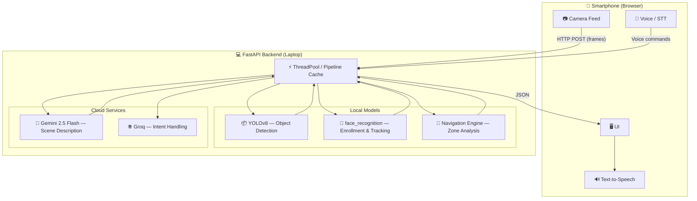

# Neytra — Spatial AI Companion for the Visually Impaired

> Real-time object detection, face memory, obstacle navigation, and AI scene description — all voice-controlled, designed for independence.

---

## Features

**Parallel AI Processing**
YOLO, face recognition, and LLM queries execute concurrently via a custom background worker queue. End-to-end latency under 500ms.

**Smart Face Enrollment**
Detects unknown faces and allows on-the-fly enrollment via voice — *"add John to memory"*. A temporal sliding window prevents repeated recognition alerts.

**Navigation & Obstruction Avoidance**
Divides the camera frame into left / ahead / right zones and guides the user around obstacles in real time.

**LLM Vision — "What am I looking at?"**
Powered by Gemini 2.5 Flash. Snapshot any environment and ask a natural language question — get an immediate spoken scene breakdown.

**Voice-Native Interface**
Fully operable via Web Speech API. Scan modes, feature activation, and face enrollment — all hands-free.

---

## Architecture



---

## Tech Stack

| Layer | Technology |
|---|---|
| Backend | Python 3.12, FastAPI |
| Object Detection | Ultralytics YOLOv8 |
| Face Recognition | `face_recognition` (dlib) |
| Vision LLM | Google Gemini 2.5 Flash |
| Intent Handling | Groq API (optional) |
| Frontend | Vanilla HTML5 / JS, Web Speech API, WebRTC |

---

## Setup

### Prerequisites

- Python 3.10 or later
- C++ Build Tools (required on Windows to compile `dlib`)
- API keys for Google Gemini and optionally Groq

### 1. Clone the repository

```bash
git clone <your-repo-link>
cd Neytra
```

### 2. Create and activate a virtual environment

```bash
python -m venv venv

# Windows
venv\Scripts\activate

# macOS / Linux
source venv/bin/activate
```

### 3. Install dependencies

```bash
cd Face/backend
python -m pip install --upgrade pip
python -m pip install --ignore-installed -r requirements.txt
```

> **Windows note:** If `face_recognition` or `dlib` fails to install, ensure Visual Studio Build Tools is installed with the **Desktop development with C++** workload selected.

### 4. Configure API keys

Create a `.env` file inside `Face/backend/`:

```env
GOOGLE_API_KEY=your_gemini_key_here
GROQ_API_KEY=your_groq_key_here   # optional
```

### 5. Start the backend

```bash
# From Face/backend/ with venv active
python start-server.py
```

The server starts on port `8000`. Keep this terminal running.

### 6. Open the client

1. Open `Face/mobile-client/index.html` in Chrome (recommended for full Web Speech API support).
2. Set the `backendURL` constant near line 296 to your machine's local IP:

```js
const backendURL = "http://192.168.x.x:8000";  // or http://localhost:8000
```

3. Allow camera and microphone permissions when prompted.
4. Press **Start Mode** — you're live.

---

## Voice Commands

| Say | Action |
|---|---|
| *"Scan mode"* | Standard object detection |
| *"Quick scan"* | Fast obstacle detection |
| *"Face recognition"* | Switch to face ID mode |
| *"What am I looking at?"* | Gemini vision analysis |
| *"Add [name] to memory"* | Enroll a detected face |
| *"Stop"* | Pause narration |

---

## Keyboard Shortcuts

| Key | Action |
|---|---|
| `V` | Toggle voice input |
| `S` | Toggle scanning |
| `A` | Analyze scene |
| `1` / `2` / `3` | Switch scan modes |